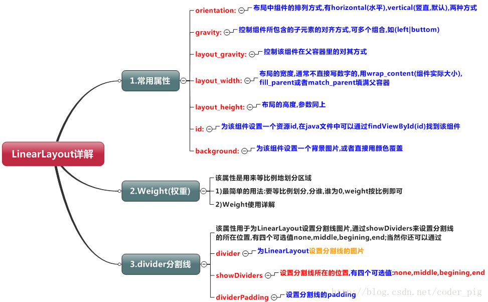
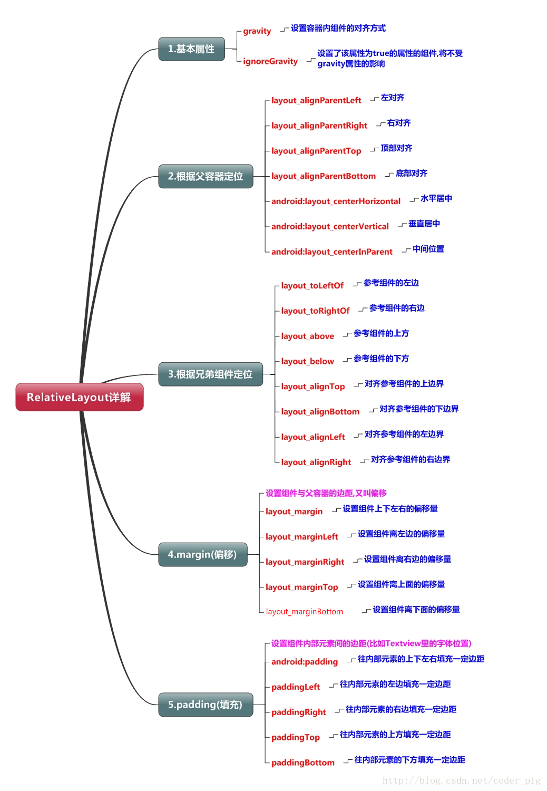
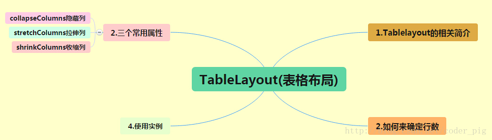
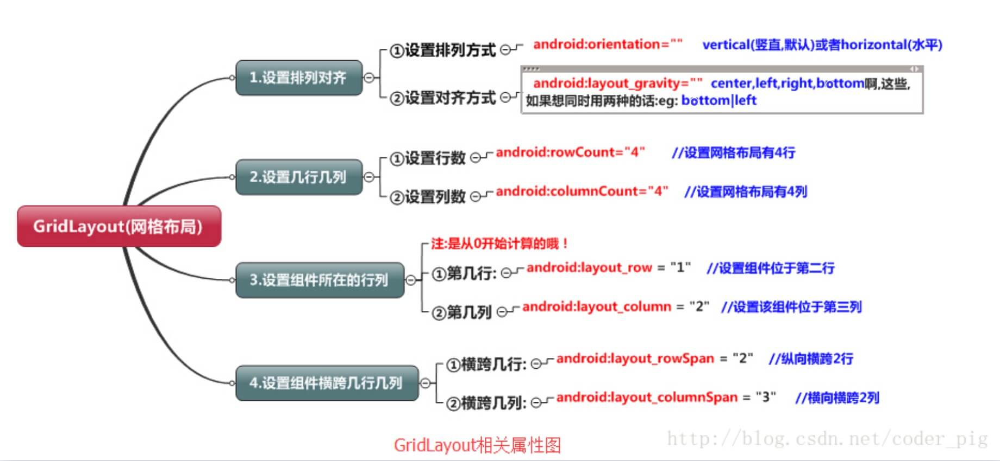

### 线性布局

设置weight属性：
```java
setLayoutParams(new LayoutParams(LayoutParams.FILL_PARENT, LayoutParams.WRAP_CONTENT, 1)); 
```
设置分割线：
```xml
<LinearLayout xmlns:android="http://schemas.android.com/apk/res/android"  
    ...  
    android:divider="@drawable/ktv_line_div"  分割线图片
    android:orientation="vertical"  
    android:showDividers="middle"  none(无),beginning(开始),end(结束),middle(每两个组件间)
    android:dividerPadding="10dp"  间距
    ... >  
    </LinearLayout>
```
layout_gravity属性注意点：  
当 android:orientation="vertical" 时， 只有水平方向的设置才起作用，垂直方向的设置不起作用。 即：left，right，center_horizontal 是生效的。  
当 android:orientation="horizontal" 时， 只有垂直方向的设置才起作用，水平方向的设置不起作用。 即：top，bottom，center_vertical 是生效的。

### 相对布局

margin与padding的区别：  
margin代表的是偏移，针对的是容器中的组件；  
padding代表的是填充。针对的是组件中的元素。  
注意！margin的值可以设置为负数：
```xml
<ImageView  
        android:id="@+id/imgCancle"  
        android:layout_width="28dp"  
        android:layout_height="28dp"  
        android:layout_alignRight="@id/imgBack"  
        android:layout_alignTop="@id/imgBack"  
        android:background="@drawable/cancel"  
        android:layout_marginTop="-15dp"  
        android:layout_marginRight="-10dp" />
```

### 表格布局

确定行数和列数：
- 如果我们直接往TableLayout中添加组件的话,那么这个组件将占满一行！！！
- 如果我们想一行上有多个组件的话,就要添加一个TableRow的容器,把组件都丢到里面！
- tablerow中的组件个数就决定了该行有多少列,而列的宽度由该列中最宽的单元格决定 
- tablerow的layout_width属性,默认是fill_parent的,我们自己设置成其他的值也不会生效！！！ 但是layout_height默认是wrapten——content的,我们却可以自己设置大小！
- 整个表格布局的宽度取决于父容器的宽度(占满父容器本身)
- 有多少行就要自己数啦,一个tablerow一行,一个单独的组件也一行！多少列则是看tableRow中 的组件个数,组件最多的就是TableLayout的列数

五个属性：
```
android:collapseColumns:设置需要被隐藏的列的序号
android:shrinkColumns:设置允许被收缩的列的列序号
android:stretchColumns:设置运行被拉伸的列的列序号

以上这三个属性的列号都是从0开始算的,比如shrinkColunmns = "2",对应的是第三列！
可以设置多个,用逗号隔开比如"0,2",如果是所有列都生效,则用"*"号即可

android:layout_column="2":表示的就是跳过第二个,直接显示到第三个格子处,从1开始算的!
android:layout_span="4":表示合并4个单元格,也就说这个组件占4个单元格
```

### 帧布局
前景图像:永远处于帧布局最上面,直接面对用户的图像,就是不会被覆盖的图片。  
两个属性:  
android:foreground:设置该帧布局容器的前景图像  
android:foregroundGravity:设置前景图像显示的位置

### 网格布局

我们通过:android:layout_rowSpan与android:layout_columnSpan设置了组件横跨 多行或者多列的话,
如果你要让组件填满横越过的行或列的话,需要添加下面这个属性: android:layout_gravity = "fill"！！！  
  
用法归纳：
- step 1:先定义组件的对其方式 android:orientation 水平或者竖直,设置多少行与多少列
- step 2:设置组件所在的行或者列,记得是从0开始算的,不设置默认每个组件占一行一列
- step 3:设置组件横跨几行或者几列;设置完毕后,需要在设置一个填充:android:layout_gravity = "fill"

### 绝对布局
常用四大属性：  
①控制大小: android:layout_width:组件宽度 android:layout_height:组件高度  
②控制位置: android:layout_x:设置组件的X坐标 android:layout_y:设置组件的Y坐标  


