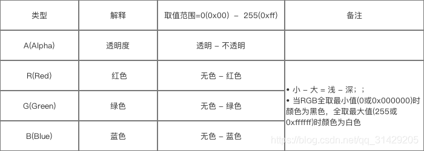

##### 位置的获取
view的位置通过view.getXXX()来获取，可以获得相对于其所在组件的坐标系坐标。
```java
public final int getTop() { 
  return mTop; 
}
getLeft();    //获取子View左上角距父View左侧的距离
getBottom();   //获取子View右下角距父View顶部的距离
getRight();   //获取子View右下角距父View左侧的距离
```
在MotionEvent中，get()方法为触摸点相对于其所在组件坐标系的坐标，getRaw()方法为触摸点相对于屏幕默认坐标系的坐标。
```java
//触摸点相对于其所在组件坐标系的坐标
event.getX();   
event.getY();
//触摸点相对于屏幕默认坐标系的坐标
event.getRawX();  
event.getRawY();
```
getMeasureWidth()与getWidth()：
- getMeasureWidth()是在measure()过程结束后就可以获取到对应的值; 通过setMeasuredDimension()方法来进行设置.
- getWidth()是在layout()过程结束后才能获取到; 通过视图右边的坐标减去左边的坐标计算出来的.
##### Android支持的颜色模式


margin的优先级问题：
margin > horizontalMargin和verticalMargin > leftMargin和RightMargin、topMargin和bottomMargin；  
属性覆盖问题：优先级更高的属性会覆盖掉优先级较低的属性。

##### addView()
```java
/**
* 重载方法1：添加一个子View
* 如果这个子View还没有LayoutParams，就为子View设置当前ViewGroup默认的LayoutParams
 */
public void addView(View child) {
  addView(child, -1);
}
/**
* 重载方法2：在指定位置添加一个子View
* 如果这个子View还没有LayoutParams，就为子View设置当前ViewGroup默认的LayoutParams
* @param index View将在ViewGroup中被添加的位置（-1代表添加到末尾）
*/
public void addView(View child, int index) {
  if (child == null) {
    throw new IllegalArgumentException("Cannot add a null child view to a ViewGroup");
 }
  LayoutParams params = child.getLayoutParams();
  if (params == null) {
    params = generateDefaultLayoutParams();// 生成当前ViewGroup默认的LayoutParams
    if (params == null) {
      throw new IllegalArgumentException("generateDefaultLayoutParams() cannot return
null");
   }
 }
  addView(child, index, params);
}
/**
* 重载方法3：添加一个子View
* 使用当前ViewGroup默认的LayoutParams，并以传入参数作为LayoutParams的width和height
*/
public void addView(View child, int width, int height) {
  final LayoutParams params = generateDefaultLayoutParams();  // 生成当前ViewGroup默认的
LayoutParams
  params.width = width;
  params.height = height;
  addView(child, -1, params);
}
/**
* 重载方法4：添加一个子View，并使用传入的LayoutParams
*/
@Override
public void addView(View child, LayoutParams params) {
  addView(child, -1, params);
}
/**
* 重载方法4：在指定位置添加一个子View，并使用传入的LayoutParams
*/
public void addView(View child, int index, LayoutParams params) {
  if (child == null) {
    throw new IllegalArgumentException("Cannot add a null child view to a ViewGroup");
 }
// addViewInner() will call child.requestLayout() when setting the new LayoutParams
  // therefore, we call requestLayout() on ourselves before, so that the child's request
  // will be blocked at our level
  requestLayout();
  invalidate(true);
  addViewInner(child, index, params, false);
}
private void addViewInner(View child, int index, LayoutParams params,
    boolean preventRequestLayout) {
 .....
  if (mTransition != null) {
    mTransition.addChild(this, child);
 }
  if (!checkLayoutParams(params)) { // ① 检查传入的LayoutParams是否合法
    params = generateLayoutParams(params); // 如果传入的LayoutParams不合法，将进行转化操作
 }
  if (preventRequestLayout) { // ② 是否需要阻止重新执行布局流程
    child.mLayoutParams = params; // 这不会引起子View重新布局（onMeasure->onLayout-
>onDraw）
 } else {
    child.setLayoutParams(params); // 这会引起子View重新布局（onMeasure->onLayout-
>onDraw）
 }
  if (index < 0) {
    index = mChildrenCount;
 }
  addInArray(child, index);
  // tell our children
  if (preventRequestLayout) {
    child.assignParent(this);
 } else {
    child.mParent = this;
 }
 .....
}
```


### 自定义View

View的四个构造函数：
```java
// 如果View是在Java代码里面new的，则调用第一个构造函数
public CarsonView(Context context) {
    super(context);
}
 
// 如果View是在.xml里声明的，则调用第二个构造函数
// 自定义属性是从AttributeSet参数传进来的
// 这个方法一般是必须重写的，因为在LayoutInfaltor中CreateView的时候，系统会通过反射调用该构造函数，如果没有重写创建View的时候会报错
public  CarsonView(Context context, AttributeSet attrs) {
    super(context, attrs);
}
 
// 不会自动调用
// 一般是在第二个构造函数里主动调用
// 如View有style属性时
public  CarsonView(Context context, AttributeSet attrs, int defStyleAttr) {
    super(context, attrs, defStyleAttr);
}
 
//API21之后才使用
// 不会自动调用
// 一般是在第二个构造函数里主动调用
// 如View有style属性时
public  CarsonView(Context context, AttributeSet attrs, int defStyleAttr, intdefStyleRes) {
    super(context, attrs, defStyleAttr, defStyleRes);
}
```